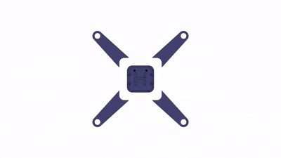

# Arx (ESP32-Drone)

This is my personal build and adaptation of the **ESP32 Drone** project originally created by Max Imagination on YouTube.

> **YouTube Build Guide:** [ESP32 Drone Video](https://www.youtube.com/watch?v=V_mZsiZcy7s&t=1047s)

  

## 📌 About This Project

This repository is mainly a **copy** of Max Imagination’s ESP32 Drone project. It’s intended for my own **learning and experimentation**.

I’m documenting my progress, tweaks, and any personal modifications here.

## ⚙️ My Changes or Notes

- Built the drone following the original guide
- Created a unique 3D model
- Planning to add a camera module

## ⚠️ Disclaimer

This is not my original project. All core credit goes to **Max Imagination** for designing and sharing the ESP32 Drone.  

## 📜 License

I could not find a clear license in the original repository. As such, I am treating this as **"All Rights Reserved" by the original author**.

This project exists purely for **personal learning and documentation**. I do not claim ownership of the original code or design. If you are the original author and would like this removed or modified, please contact me.

